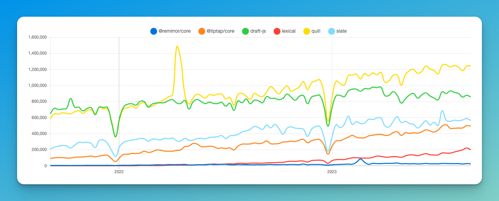

# Top Rich Text Editors for React

Source: <a href="https://npmtrends.com/@remirror/core-vs-@tiptap/core-vs-draft-js-vs-lexical-vs-quill-vs-slate">
https://npmtrends.com/@remirror/...
</a>

## Methodology

We'll start by designing the desired interface for our base component.

We'll analyze the open-source alternatives available in the market.

We'll pick the most promising ones and try them out, i.e, implement a POC with:

- All the basic use cases currently covered by Quill
- variables
- tables
- image upload
- tagging other users
